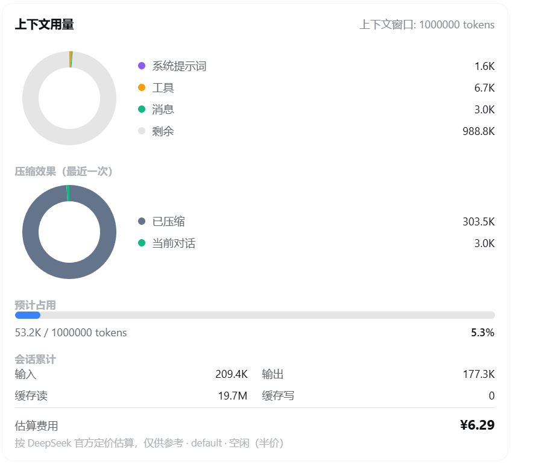

<div align="center">



<br>
</div>

# context-vista

> 一眼看清你的上下文窗口 —— token 用量、压缩收益、成本估算，尽收眼底。

为 [DeepSeek Harness](https://github.com/deepseek-ai/deepseek-harness) 提供 `/context` 斜杠命令，用**环形图**展示当前上下文 token 用量与分配，对标 Claude Code 的 `/context`。

- **Host 半部**：注册 `/context` 命令，返回文本摘要（headless / 非 Web 界面可用）。
- **Client 半部**：把 Web 端 `/context` 的命令行升级成一张卡片，包含：
  - **上下文组成环形图**：系统提示词 / 工具 schema / 消息，外加灰色"剩余"（未使用）部分，整环 = 上下文窗口。
  - **压缩效果环形图**：执行过 `/compact` 后，显示最近一次压缩释放了多少、保留了多少。
  - **占用进度条**：预计下一次请求占用 vs 上下文窗口，带百分比。
  - **会话累计 + 估算费用**：输入 / 输出 / 缓存读 / 缓存写，以及按 DeepSeek 官方定价估算的费用。
  - **常驻右侧悬浮卡**：对话区右侧空白处常驻一张**实时更新**的迷你卡片，无需输入 `/context`，内容包括：
    - **迷你环形图**：中心显示当前占用率百分比，环上分系统提示词 / 工具 / 消息 / 剩余四色。
    - **图例**：与环形图对应的各分块 token 数。
    - **预计占用**：`预计占用 ÷ 上下文窗口` tokens。
    - **估算费用**：按当前模型与峰谷时段的费用，附 `模型 @ 路由 · 高峰/空闲` 标注。
    - 按住标题栏可上下拖动并记住位置，点右上角箭头可收起/展开。

> 环形图是**手写的 SVG**，不依赖任何第三方图表库。

## 安装

先装 pnpm（一个 JavaScript 包管理器，类似 npm/yarn）。`dsh plugin add` 内部会自动调用 pnpm，所以命令**不要**写成 `pnpm dsh plugin ...`。没有 pnpm 可运行 `npm install -g pnpm` 安装。

> 下面命令都写全 `npx @deepseek-ai/dsh ...`（无需全局安装，开箱即用）。如果你已全局安装（`npm install -g @deepseek-ai/dsh`），可把 `npx @deepseek-ai/dsh` 简写成 `dsh`。

### 从 GitHub 安装（推荐）

直接复制这两条命令执行：

```sh
npx @deepseek-ai/dsh plugin --profile web add github:GooodWei/context-vista
npx @deepseek-ai/dsh web
```

> 若 pnpm 报错说拦截了 `prepare` 脚本，按提示把那个 key 加到 profile 目录 `pnpm-workspace.yaml` 的 `allowBuilds` 里，再重跑 `add` 命令。

### 从本地目录安装（开发用）

```sh
npx @deepseek-ai/dsh plugin --profile web add file:../context-vista
npx @deepseek-ai/dsh web
```

`file:` 后面是插件源码目录的相对路径（相对于你执行命令时所在的目录）。

## 使用

装好后在输入框输入 `/context` 回车即可。

另外，插件会自动在**对话区右侧**常驻一张迷你悬浮卡，实时更新、无需任何操作，从上到下依次显示：

1. **标题 + 收起按钮**（`▸` 收起为一行标题，再点 `◂` 展开）；
2. **迷你环形图**：中心是占用率百分比，环上分系统 / 工具 / 消息 / 剩余四色，下面跟图例；
3. **预计占用**：`预计占用 ÷ 上下文窗口` tokens；
4. **估算费用**：金额 + `模型 @ 路由 · 高峰/空闲` 小字标注。

**按住标题栏可上下拖动**，拖到的位置会自动记住（存在浏览器 localStorage，刷新后依然生效）。

## 数据来源与语义

客户端不做任何计算，直接读 host 已算好并推送的 session projection（`useProjection`）：

| 展示项 | projection key | 语义 |
|---|---|---|
| 组成环形图 | `contextBreakdown` | 系统 / 工具 / 消息，固定启发式（4 字符 ≈ 1 token）的**估算值** |
| 占用进度条 | `contextPressure` | `projectedTokens` ÷ `contextWindow` |
| 会话累计 | `tokenUsage` | provider **精确**累计：输入 / 输出 / 缓存读 / 缓存写 |
| 估算费用 | 同上 + 当前路由/模型 | 上述 bucket × 单价（内置官方价或用户自定义，¥/百万 tokens），**估算** |

这些是 DSH 默认 profile 已挂载的能力（`dsh-token-meter` + `dsh-session-projection`），本插件无需自建 Host RPC。

### 提醒

- `contextBreakdown` 是启发式估算，会**低估 CJK 文本和 JSON schema**；`tokenUsage` / `contextPressure` 的 provider 部分才是精确值，二者应分开看待。
- 占用率是面向用户的参考数字（非计费、非门控输入），切模型瞬间可能出现短暂错配。

### 费用估算

费用 = `uncachedInputTokens×miss + (cacheReadTokens+cacheWriteTokens)×hit + outputTokens×output`，÷ 1,000,000。当前时段（高峰/空闲）决定取哪套单价。

- 内置官方定价（¥/百万 tokens，键 = provider 路由名 → 模型名）：
  - `deepseek-official` / `deepseek-v4-pro`：高峰 命中 0.3 / 未命中 9 / 输出 27；空闲半价 0.15 / 4.5 / 13.5
  - `deepseek-official` / `deepseek-v4-flash`：高峰 命中 0.1 / 未命中 3 / 输出 9；空闲半价 0.05 / 1.5 / 4.5
  - 未匹配到的模型按 pro 档计。
- **峰谷时段**：默认北京时间（UTC+8）高峰 9:00–12:00、14:00–18:00，其余空闲；时区与窗口均可自定义（见下）。
- 因 `tokenUsage` 是累计值、无逐请求时间戳，按**当前时刻**的费率估算整段会话；跨峰谷的会话为近似值。
- 金额仅为**估算**，不是账单。

#### 自定义定价

编辑 `~/.dsh/settings.yaml`，在 `context-vista` 命名空间下覆盖或新增定价（**热加载，无需重启**）。

**最简示例**（复制追加到 `~/.dsh/settings.yaml` 末尾即可）：

```yaml
context-vista:
  pricing:
    "https://api.deepseek.com":
      deepseek-v4-pro:
        peak:    { hit: 0.3, miss: 9, output: 27 }
        offpeak: { hit: 0.15, miss: 4.5, output: 13.5 }
```

> 上面只覆盖 `deepseek-v4-pro` 的价格，其余模型仍用内置官价。

**完整示例**（含时区、峰谷时段、自定义 endpoint、通配符兜底）：

```yaml
context-vista:
  timezone: 8                        # 峰谷时段所在时区（相对 UTC 的小时偏移），默认 8 = 北京时间
  peakWindows:                       # 高峰窗口，HH:MM，含起点不含终点；start > end 表示跨午夜
    - start: "09:00"
      end: "12:00"
    - start: "14:00"
      end: "18:00"
  pricing:                           # 键 = 路由名 或 baseURL → 模型名 → 价格；支持 * 通配符
    "https://api.deepseek.com":      # 按字面 baseURL 键（覆盖内置路由的某模型，其余保持不变）
      deepseek-v4-pro:
        peak:    { hit: 0.3, miss: 9, output: 27 }
        offpeak: { hit: 0.15, miss: 4.5, output: 13.5 }
    "https://my-gateway.example.com/v1":  # 自定义 endpoint，按 baseURL 键
      my-model:
        peak:    { hit: 1, miss: 5, output: 20 }
        offpeak: { hit: 0.5, miss: 2.5, output: 10 }
    "*":                              # 兜底：所有路由下未单独列出的模型
      "*": { hit: 0.3, miss: 9, output: 27 }
```

- **定价键两种写法均可**：
  - **provider 路由名**（Models 设置里的「API 路由」，内置 DeepSeek 为 `deepseek-official`）；
  - **字面 baseURL**（如 `https://api.deepseek.com`），插件会从 LLM 适配器的可配置 provider 解析出 `provider → baseURL` 映射来命中。
  - 含 `:` 的键（baseURL）在 YAML 里**必须加引号**，否则会被当成注释/冒号语法。
- 价格条目两种写法：**平坦** `{ hit, miss, output }`（不分峰谷），或 **峰谷** `{ peak, offpeak }`（各自 `{hit, miss, output}`，可只给其中一个）。
- 命中顺序：`baseURL.model` → `baseURL.*` → `provider.model` → `provider.*` → `*.model` → `*.*` → 内置默认（模型名含 `flash` 按 flash，否则 pro）。
- 若某 provider 的 baseURL 无法解析（非可配置 provider、或 settings 里没有 baseURL），按 baseURL 写的键会回退到 provider 路由名匹配。
- headless 命令即时生效；Web 卡片在下次会话事件（如再发一条消息、再执行一次 `/context`）后刷新。

## License

MIT
